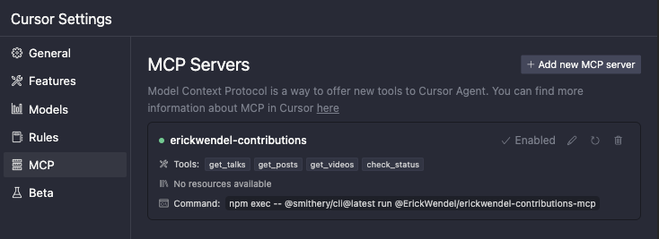

# erickwendel-contributions-mcp


[](https://smithery.ai/server/@ErickWendel/erickwendel-contributions-mcp)

A Model Context Protocol (MCP) server that provides tools to query [Erick Wendel's contributions](https://erickwendel.com.br/) across different platforms. Query talks, blog posts, and videos using natural language through Claude, Cursor or similars. This project was built using [Cursor](https://cursor.sh) IDE with the default agent (trial version).

This MCP server is also available on [Smithery](https://smithery.ai/server/@ErickWendel/erickwendel-contributions-mcp) for direct integration.

## Available Tools

This MCP server provides the following tools to interact with the API:

- `get-talks`: Retrieves a paginated list of talks with optional filtering
  - Supports filtering by ID, title, language, city, country, and year
  - Can return counts grouped by language, country, or city

- `get-posts`: Fetches posts with optional filtering and pagination
  - Supports filtering by ID, title, language, and portal

- `get-videos`: Retrieves videos with optional filtering and pagination
  - Supports filtering by ID, title, and language

- `check-status`: Verifies if the API is alive and responding

# Integration with AI Tools

## Inspect MCP Server Capabilities

You can inspect this MCP server's capabilities using Smithery:

```bash
npx -y @smithery/cli@latest inspect @ErickWendel/erickwendel-contributions-mcp
```

This will show you all available tools, their parameters, and how to use them.

## Setup

1. Make sure you're using Node.js v23+
```bash
node -v
#v23.9.0
```

2. Clone this repository:
```bash
git clone https://github.com/erickwendel/erickwendel-contributions-mcp.git
cd erickwendel-contributions-mcp
```

3. Restore dependencies:
```bash
npm ci
```

## Integration with AI Tools

### Cursor Setup

1. Open Cursor Settings
2. Navigate to MCP section
3. Click "Add new MCP server"
4. Configure the server:
   ```
   Name = erickwendel-contributions
   Type = command
   Command = node ABSOLUTE_PATH_TO_PROJECT/src/index.ts
   ```

   or if you prefer executing it from Smithery
   ```
   Name = erickwendel-contributions
   Type = command
   Command = npm exec -- @smithery/cli@latest run @ErickWendel/erickwendel-contributions-mcp
   ```


or configure directly from the Cursor's global MCP file located in `~/.cursor/mcp.json` and add the following:

```json
{
  "mcpServers": {
    "erickwendel-contributions": {
      "command": "node",
      "args": ["ABSOLUTE_PATH_TO_PROJECT/src/index.ts"]
    }
  }
}
```
or if you prefer executing it from Smithery
```json
{
  "mcpServers": {
    "erickwendel-contributions": {
      "command": "npm",
      "args": [
        "exec",
        "--",
        "@smithery/cli@latest",
        "run",
        "@ErickWendel/erickwendel-contributions-mcp"
      ]
    }
  }
}
```

5. Make sure Cursor chat is in Agent mode by selecting "Agent" in the lower left side dropdown

6. Go to the chat an ask "how many videos were published about JavaScript in 2024"


### Claude Desktop Setup

#### Installing via Smithery

To install Erick Wendel Contributions for Claude Desktop automatically via [Smithery](https://smithery.ai/server/@ErickWendel/erickwendel-contributions-mcp):

```bash
npx -y @smithery/cli install @ErickWendel/erickwendel-contributions-mcp --client claude
```

> **Note**: The Smithery CLI installation for Claude is currently experiencing issues. Please use the manual installation method below until this is resolved.

#### Manual Setup

1. Go to Claude settings
2. Click in the Developer tab
3. Click in edit config
4. Open the config in a code editor
5. Add the following configuration to your Claude Desktop config:

```json
{
  "mcpServers": {
    "erickwendel-contributions": {
      "command": "node",
      "args": ["ABSOLUTE_PATH_TO_PROJECT/src/index.ts"]
    }
  }
}
```
or if you prefer executing it from Smithery
```json
{
  "mcpServers": {
    "erickwendel-contributions": {
      "command": "npm",
      "args": [
        "exec",
        "--",
        "@smithery/cli@latest",
        "run",
        "@ErickWendel/erickwendel-contributions-mcp"
      ]
    }
  }
}
```

6. Save file and Restart Claude Desktop
7. Open the Developer tab again and check if it's in the "running" state as follows:


8. Go to the chat and ask "Are there videos about RAG?"


### Free Alternative Using MCPHost

If you don't have access to Claude Desktop nor Cursor, you can use [MCPHost](https://github.com/mark3labs/mcphost) with Ollama as a free alternative. MCPHost is a CLI tool that enables Large Language Models to interact with MCP servers.

1. Install MCPHost:
```bash
go install github.com/mark3labs/mcphost@latest
```

2. Create a config file (e.g. [./mcp.jsonc](./mcp.jsonc)):
```json
{
  "mcpServers": {
    "erickwendel-contributions": {
      "command": "node",
      "args": ["ABSOLUTE_PATH_TO_PROJECT/src/index.ts"]
    }
  }
}
```
or if you prefer executing it from Smithery
```json
{
  "mcpServers": {
    "erickwendel-contributions": {
      "command": "npm",
      "args": [
        "exec",
        "--",
        "@smithery/cli@latest",
        "run",
        "@ErickWendel/erickwendel-contributions-mcp"
      ]
    }
  }
}
```
3. Run MCPHost with your preferred Ollama model:
```bash
ollama pull MODEL_NAME
mcphost --config ./mcp.jsonc -m ollama:MODEL_NAME
```

## Example Queries

Here are some examples of queries you can ask Claude, Cursor or any MCP Client:

1. "How many talks were given in 2023?"


2. "Show me talks in Spanish"


3. "Find posts about WebXR"


# Development
## Features

- Built with Model Context Protocol (MCP)
- Type-safe with TypeScript and Zod schema validation
- Native TypeScript support in Node.js without transpilation
- Generated SDK using [GenQL](https://genql.dev)
- Modular architecture with separation of concerns
- Standard I/O transport for easy integration
- Structured error handling
- Compatible with Claude Desktop, Cursor, and [MCPHost](https://github.com/mark3labs/mcphost) (free alternative)

> Note: This project requires Node.js v23+ as it uses the native TypeScript support added in the last year.

## Architecture

The codebase follows a modular structure:

```
src/
  ├── config/      # Configuration settings
  ├── types/       # TypeScript interfaces and types
  ├── tools/       # MCP tool implementations
  ├── utils/       # Utility functions
  ├── services/    # API service layer
  └── index.ts     # Main entry point
```

## Testing

To run the test suite:

```bash
npm test
```

For development mode with watch:

```bash
npm run test:dev
```

## Contributing

Contributions are welcome! Please feel free to submit a Pull Request.

## Author

[Erick Wendel](https://linktr.ee/erickwendel)

## License

This project is licensed under the MIT License - see the [LICENSE](./LICENSE) file for details. 